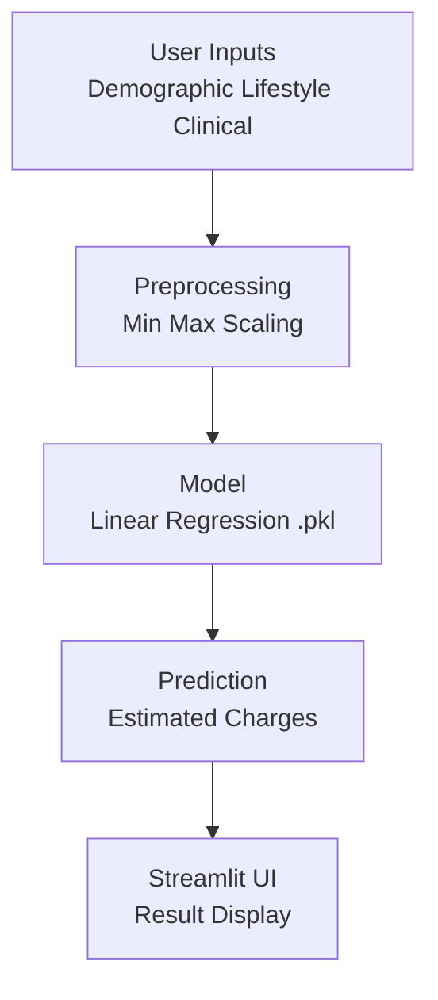

<div align="center">

<h1 style="font-size:38px">🏥 INSURANCE CHARGES PREDICTION</h1>

An elegant Machine Learning application that predicts medical insurance charges using a Linear Regression model wrapped in a clean Streamlit interface.

<br>


<br><br>

🔗 <b>Live App:</b><br>
https://insurancechargesprediction-wmhqgjcwk6mzpwpj7hltnx.streamlit.app/

</div>

<br>

<h2 style="font-size:30px">1. Overview</h2>

This project estimates individual health insurance charges from ten demographic, lifestyle and clinical attributes.  
It showcases a complete ML workflow including preprocessing, scaling and deployment in a user friendly Streamlit application.

This project suits healthcare analytics learners and beginners exploring ML deployment.

<br>

<h2 style="font-size:30px">2. Features</h2>

• Interactive modern UI  
• Real time predictions  
• Built in min max scaling  
• Lightweight linear regression model  
• One click Streamlit Cloud deployment  
• Easy to extend and modify  

<br>

<h2 style="font-size:30px">3. Workflow Diagram</h2>


```mermaid
flowchart TD
    A[User Inputs<br>Demographic Lifestyle Clinical] --> B[Preprocessing<br>Min Max Scaling]
    B --> C[Model<br>Linear Regression .pkl]
    C --> D[Prediction<br>Estimated Charges]
    D --> E[Streamlit UI<br>Result Display]
```
<br> <h2 style="font-size:30px">4. Input Features</h2>

The model takes ten source variables, six demographic and lifestyle and four clinical.
These expand to thirteen model inputs once region is one hot encoded.

| Feature    | Type     | Details               | Min max scaled |
| ---------- | -------- | --------------------- | -------------- |
| Age        | Numeric  | Person’s age in years | yes            |
| BMI        | Numeric  | Body Mass Index       | yes            |
| Gender     | Category | Male or Female        | no             |
| Smoker     | Category | Yes or No             | no             |
| Region     | Category | NE NW SE SW           | no             |
| Children   | Numeric  | Number of dependents  | no             |
| Diabetes   | Category | 0 or 1                | no             |
| Heart rate | Numeric  | Beats per minute      | yes            |
| Creatinine | Numeric  | Serum creatinine      | yes            |
| Glucose    | Numeric  | Blood glucose         | yes            |

<br> <h2 style="font-size:30px">5. Project Structure</h2>

```
Insurance_Charges_Prediction/
│── app.py
│── train.py
│── Health_insurance.csv
│── linear_regression_model.pkl
│── min_max_values.json
│── requirements.txt
│── README.md
```

Run `python train.py` to regenerate the model and the scaling ranges from the
dataset. It prints the performance figures in section 9 so they can be checked
against the shipped artefacts.

<br> <h2 style="font-size:30px">6. Installation</h2>

Install locally with Python

- Step 1: Clone the repository  
  git clone https://github.com/venkateshanayakb/Insurance_Charges_Prediction.git

- Step 2: Navigate into the project folder  
  cd Insurance_Charges_Prediction

- Step 3: Install all required dependencies  
  pip install -r requirements.txt

- Step 4: Launch the Streamlit application  
  streamlit run app.py

<br> <h2 style="font-size:30px">7. Usage</h2>

Enter user details in the interface
Tap “Predict”
View predicted insurance charges instantly

<br> <h2 style="font-size:30px">8. Example Predictions</h2>

Clinical inputs held at heart rate 75, creatinine 1.0, glucose 100.

| Age | BMI  | Smoker | Predicted Charges |
| --- | ---- | ------ | ----------------- |
| 30  | 24.3 | No     | $2,795            |
| 45  | 29.7 | Yes    | $32,427           |
| 52  | 31.1 | No     | $12,367           |

<br> <h2 style="font-size:30px">9. Model Performance</h2>

Measured on the 1,148 complete cases in `Health_insurance.csv`.
Reproduce with `python train.py`.

| Metric                  | Value |
| ----------------------- | ----- |
| R², 5 fold cross validation | 0.744 |
| RMSE, 5 fold cross validation | $6,053 |
| R², in sample           | 0.750 |
| RMSE, in sample         | $5,995 |
| MAE, in sample          | $4,159 |

Cross validated and in sample scores agree to within 0.006, so the fit is not
carrying meaningful variance from the training split.

**Smoker status is the dominant cost driver.** On its own it explains an R² of
0.617, which is most of the model's total explanatory power, and it carries a
coefficient of −23,704 against a mean charge of 13,294. Age and BMI matter, but
neither approaches it.

<br> <h2 style="font-size:30px">10. Deployment</h2>

Deployed on Streamlit Cloud.
Any push to the main branch automatically updates the live application.

<br> <h2 style="font-size:30px">11. Contributing</h2>

Fork the repository, create a new branch and submit a pull request for improvements or new features.

<br> <h2 style="font-size:30px">12. License</h2>

This project is released under the MIT License. The license file is available in the repository.
