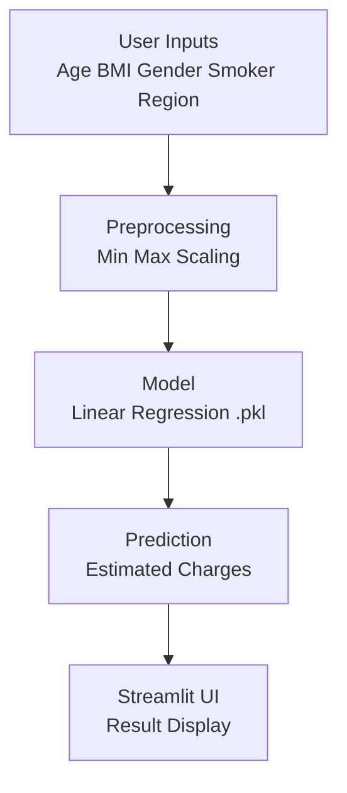

<div align="center">

<h1 style="font-size:38px">🏥 INSURANCE CHARGES PREDICTION</h1>

An elegant Machine Learning application that predicts medical insurance charges using a Linear Regression model wrapped in a clean Streamlit interface.

<br>


<br><br>

🔗 <b>Live App:</b><br>
https://insurancechargesprediction-wmhqgjcwk6mzpwpj7hltnx.streamlit.app/

</div>

<br>

<h2 style="font-size:30px">1. Overview</h2>

This project estimates individual health insurance charges using demographic and lifestyle attributes.  
It showcases a complete ML workflow including preprocessing, scaling and deployment in a user friendly Streamlit application.

This project suits healthcare analytics learners and beginners exploring ML deployment.

<br>

<h2 style="font-size:30px">2. Features</h2>

• Interactive modern UI  
• Real time predictions  
• Built in min max scaling  
• Lightweight linear regression model  
• One click Streamlit Cloud deployment  
• Easy to extend and modify  

<br>

<h2 style="font-size:30px">3. Workflow Diagram</h2>


<br> <h2 style="font-size:30px">4. Input Features</h2>

| Feature  | Type     | Details               |
| -------- | -------- | --------------------- |
| Age      | Numeric  | Person’s age in years |
| BMI      | Numeric  | Body Mass Index       |
| Gender   | Category | Male or Female        |
| Smoker   | Category | Yes or No             |
| Region   | Category | NE NW SE SW           |
| Children | Numeric  | Number of dependents  |

<br> <h2 style="font-size:30px">5. Project Structure</h2>

```
Insurance_Charges_Prediction/
│── app.py
│── linear_regression_model.pkl
│── min_max_values.json
│── requirements.txt
│── README.md
```
<br> <h2 style="font-size:30px">6. Installation</h2>

Install locally with Python

- Step 1: Clone the repository  
  git clone https://github.com/venky23/Insurance_Charges_Prediction.git

- Step 2: Navigate into the project folder  
  cd Insurance_Charges_Prediction

- Step 3: Install all required dependencies  
  pip install -r requirements.txt

- Step 4: Launch the Streamlit application  
  streamlit run app.py

<br> <h2 style="font-size:30px">7. Usage</h2>

Enter user details in the interface
Tap “Predict”
View predicted insurance charges instantly

<br> <h2 style="font-size:30px">8. Example Predictions</h2>
| Age | BMI  | Smoker | Predicted Charges |
| --- | ---- | ------ | ----------------- |
| 30  | 24.3 | No     | ₹8400             |
| 45  | 29.7 | Yes    | ₹23700            |
| 52  | 31.1 | No     | ₹16400            |

<br> <h2 style="font-size:30px">9. Deployment</h2>

Deployed on Streamlit Cloud.
Any push to the main branch automatically updates the live application.

<br> <h2 style="font-size:30px">10. Contributing</h2>

Fork the repository, create a new branch and submit a pull request for improvements or new features.

<br> <h2 style="font-size:30px">11. License</h2>

This project is released under the MIT License. The license file is available in the repository.
